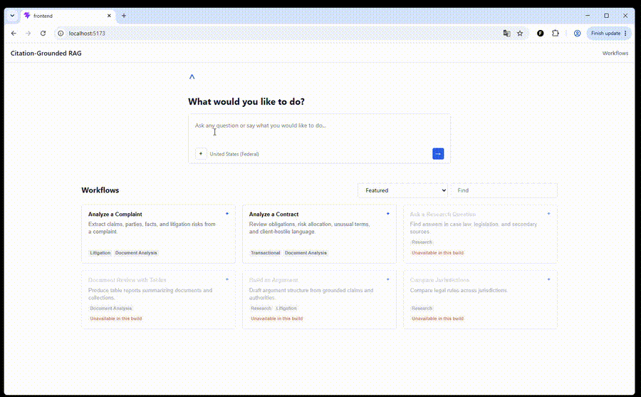
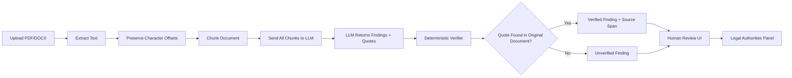
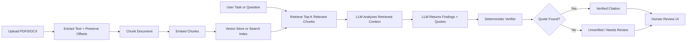
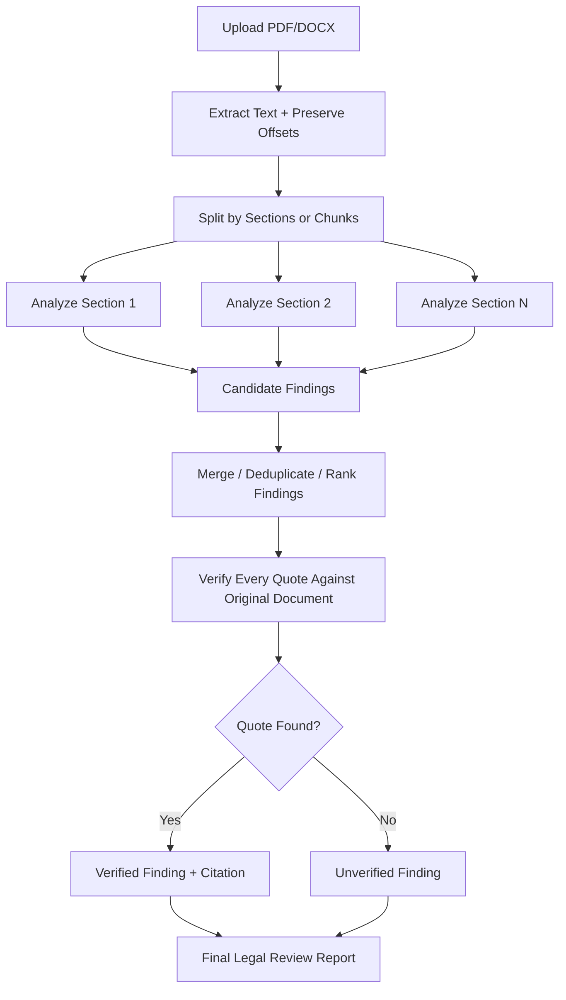

# Citation-Grounded RAG

A legal AI demo focused on a practical problem: **how do we make LLM output
reviewable and trustworthy when the domain requires citations?**

The app lets a user upload a contract or litigation complaint, extracts legal
findings, and ties each finding back to source text that can be verified.

The core design is simple:

```text
LLM generates candidate legal findings.
Code verifies whether each finding is grounded in the source document.
The UI shows both the answer and the evidence.
```

This is not meant to be a production legal AI system. It is a focused MVP that
shows how to design an AI feature around trust, citations, and human review.

## Demo Video

The animation below is a short preview of the demo. Click it to open the full
1 minute 33 second MP4 recording.

[](assets/demo.mp4)

In the demo, I walk through the two supported workflows: complaint analysis and
contract analysis. The key feature is citation-grounded reasoning: the LLM
generates candidate legal findings, but the backend verifies whether each cited
quote actually exists in the uploaded document before showing it as verified.
The UI is designed for human review, with findings, source citations,
verification badges, and related Legal Authorities shown together.

## Why This Project Matters

Legal AI is not just about generating fluent answers. A useful legal review tool
must help a human answer:

- Where did this claim come from?
- Can I inspect the exact source text?
- Is the citation real, or did the model invent/paraphrase it?
- What should be flagged for human review?

This project demonstrates that pattern with a small, inspectable codebase. The
LLM can generate candidate analysis, but the system uses deterministic code to
verify whether the cited quote exists in the uploaded document.

## What You Are Looking At

The app is a legal-document review demo. A user starts with one of two workflows:

- **Analyze a Complaint**: review a litigation complaint and surface claims,
  allegations, parties, and legal issues.
- **Analyze a Contract**: review a contract and surface risks, obligations, and
  business/legal issues.

After the user chooses a workflow, the app loads or uploads a document, runs an
analysis, and shows a review workspace. The workspace is designed around one
question:

```text
Can the AI answer be traced back to real source text?
```

The UI is not just a chatbot. It is a human-review interface with findings,
quotes, verification badges, citations, source text, and related legal sources.

## Project Pitch

I built this project to explore how AI can be used in the legal industry without
blindly trusting model output. The app supports two legal workflows:

- **Analyze a Complaint**: identify claims, allegations, parties, and legal issues
  from a litigation complaint.
- **Analyze a Contract**: identify risks, obligations, and business/legal issues
  from a contract.

The important design decision is that the LLM does not get to decide whether its
own answer is supported. The LLM returns a finding plus a quote. The backend then
uses deterministic string matching to verify whether that quote actually exists
in the uploaded document. If it matches, the finding is marked verified. If it
does not match, the UI shows it as unverified instead of hiding the problem.

Best one-line explanation:

> The LLM can reason, but code verifies the citation.

## What This Demonstrates

- **AI product judgment**: legal AI needs evidence, provenance, and reviewability,
  not just fluent summaries.
- **RAG and grounding basics**: documents are extracted, chunked, analyzed, and
  linked back to exact source spans.
- **Hallucination control**: the verifier is deterministic and separate from the
  model.
- **Structured LLM output**: the model is asked for schema-shaped findings instead
  of free-form text.
- **Reusable workflow design**: complaint analysis and contract analysis share the
  same engine, with different profiles.
- **Human-in-the-loop UI**: the interface shows findings, citations, verification
  status, source text, and related legal authorities.

## Technical Highlights

- **One engine, multiple workflows**: complaint analysis and contract analysis
  share the same extraction, chunking, LLM, verification, and UI pipeline. New
  workflows can be added with profiles, prompts, and schemas.
- **Server-side verification**: the client cannot mark a finding as verified.
  Verification is computed by the backend after exact quote matching.
- **Offset preservation**: source spans are preserved through extraction,
  chunking, analysis, and UI highlighting.
- **Structured model output**: findings are generated as schema-shaped data, not
  unstructured prose.
- **Offline demo mode**: `GROUNDING_STUB=1` allows the full UI flow to run without
  a live LLM key while still exercising the real verifier.

## Good Files To Review

- `backend/services/verifier.py`: deterministic quote verification.
- `backend/services/chunker.py`: offset-preserving chunking.
- `backend/services/llm_finding.py`: structured LLM call and offline stub mode.
- `backend/profiles/`: contract and complaint profile definitions.
- `frontend/src/App.tsx`: workflow shell for complaint and contract analysis.
- `frontend/src/components/`: legal review UI components.
- `ARCHITECTURE.md`: deeper explanation of the system and tradeoffs.

## What Are Legal Authorities?

Legal authorities are external legal sources that lawyers or reviewers may rely
on when evaluating an issue. Examples include:

- **Cases**: court opinions and precedent.
- **Statutes and regulations**: laws and agency rules.
- **Secondary sources**: explanatory legal materials or guidance.

In this project, the Legal Authorities panel retrieves related sources from a
small local corpus. For example, if a contract finding raises an antitrust issue,
the panel may show related antitrust statutes, merger guidelines, or cases.

This is the simple RAG part of the project:

```text
Finding from uploaded document
  -> retrieve related legal authorities
  -> show source type, relevance, quote, summary, and URL
```

In the MVP, this uses local JSONL data and TF-IDF similarity. It is intentionally
simple so the demo can focus on the grounding workflow instead of infrastructure.

## Demo Flow

1. Open the UI.
2. Choose `Analyze a Complaint` or `Analyze a Contract`.
3. Use the bundled demo document, or upload a PDF/DOCX under 20 MB.
4. Select analysis tasks and represented parties.
5. Run the analysis.
6. Click citations/findings to inspect the exact source text and legal authorities.

## Architecture

```text
React/Vite UI
  -> FastAPI backend
    -> PDF/DOCX extraction
    -> offset-preserving chunking
    -> profile-specific LLM analysis
    -> deterministic quote verification
    -> legal-authority retrieval panel
```

The frontend defaults to `http://localhost:8010` for API calls. The UI runs on
Vite at `http://localhost:5173`.

## System Design

### Current MVP



### Production Option: Top-K Retrieval



### Production Option: Map-Reduce / Section Analysis



The MVP sends all chunks to the LLM because the demo documents are small. In a
production system, top-k retrieval would fit targeted questions, while
map-reduce or section-by-section analysis would fit complete document review. In
both designs, deterministic verification remains at the end: retrieval controls
what the model sees, but verification checks what the model claims.

## Quick Start

Run the backend and frontend in separate terminals from the repository root.

### 1. Backend

Create and activate a virtual environment if needed:

```powershell
python -m venv .venv
.\.venv\Scripts\Activate.ps1
pip install -r backend\requirements.txt
```

Start the API in offline demo mode:

```powershell
$env:GROUNDING_STUB='1'
python -m uvicorn backend.main:app --reload --port 8010
```

The backend will be available at:

```text
http://localhost:8010
```

### 2. Frontend

```powershell
cd frontend
npm install
npm run dev
```

Open the UI at:

```text
http://localhost:5173
```

To point the frontend at another backend, set `VITE_API_BASE`.

## Offline Demo Mode

For local demos, use:

```powershell
$env:GROUNDING_STUB='1'
```

This avoids live LLM calls and returns canned findings. The verifier still runs
against the real document text, so verified/unverified badges are not faked.

## Live LLM Mode

Unset `GROUNDING_STUB` and provide Anthropic credentials:

```powershell
Remove-Item Env:\GROUNDING_STUB -ErrorAction SilentlyContinue
$env:ANTHROPIC_API_KEY='your-key-here'
python -m uvicorn backend.main:app --reload --port 8010
```

The current backend uses the Anthropic SDK with `claude-haiku-4-5-20251001`.

## Useful Commands

Backend tests:

```powershell
python -m pytest
```

Frontend build:

```powershell
cd frontend
npm run build
```

Frontend lint:

```powershell
cd frontend
npm run lint
```

## MVP Boundaries

- This is a demo system, not legal advice and not production legal software.
- Documents are stored in memory; restarting the backend clears uploads.
- DOCX page citations are always page 1 because `python-docx` does not expose
  rendered pagination.
- The authority corpus is local JSONL with TF-IDF cosine retrieval, not a vector
  database.
- Authority summaries are seeded/canned in the local corpus.
- The frontend is a single-page app with local React state, no router.

## What I Would Improve Next

- Replace the local authority corpus with a larger legal corpus and stronger
  retrieval.
- Add persistence for uploaded documents and analysis sessions.
- Add fuzzy quote matching for harmless formatting differences while preserving
  strict verification rules.
- Improve PDF layout handling for multi-column or scanned documents.
- Add evals that measure quote-match rate, unverified rate, and retrieval quality.

See `ARCHITECTURE.md` for the full system explanation and implementation details.
